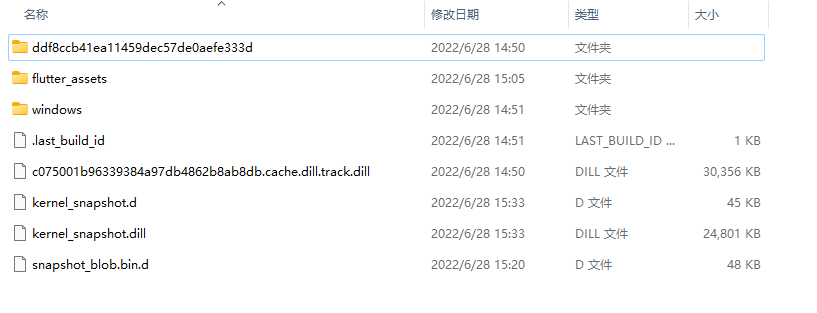
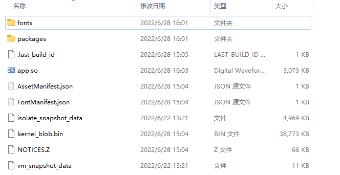

# 树莓派3B 使用 Flutter-pi 运行 flutter 应用
- [https://github.com/ardera/flutter-pi](https://github.com/ardera/flutter-pi)
- 可以直接安装这个项目说明来就可以，下面只是个人的记录
--------------------
## 树莓派系统版本 aarch64

- 系统版本：[https://downloads.raspberrypi.org/raspios_lite_arm64/images/raspios_lite_arm64-2022-04-07/2022-04-04-raspios-bullseye-arm64-lite.img.xz](https://downloads.raspberrypi.org/raspios_lite_arm64/images/raspios_lite_arm64-2022-04-07/2022-04-04-raspios-bullseye-arm64-lite.img.xz)
- 只是做个简单的记录
- demo.tar.gz 是已经编译好了应用
   ```bash
   tar -zxvf demo.tar.gz --strip-components 1 -C ~/my_app
   ```
- flutter.pi.tar.gz 编译好的flutter-pi
   - 解压到/usr/lib
   - 注意权限问题
      - libflutter_engine.so 应该是 libflutter_engine.so.release 的连接，这里就不处理这个问题了。
   ```bash
   sudo tar -zxvf flutterpi.tar.gz --strip-components 1 -C /usr/lib
   cd /usr/lib
   ls -l libflutter_engine.so*
      -rwxr-xr-x 1 root root 12154520 Jun 29 11:25 libflutter_engine.so
      -rwxr-xr-x 1 root root 33810936 Jun 29 11:25 libflutter_engine.so.debug
      -rwxr-xr-x 1 root root 16701440 Jun 29 11:25 libflutter_engine.so.profile
      -rwxr-xr-x 1 root root 12154520 Jun 29 11:25 libflutter_engine.so.release
   ls -l icudtl.dat
      -rwxr-xr-x 1 root root 10284336 Jun 29 11:25 icudtl.dat
   ls -l flutter-pi
      -rwxr-xr-x 1 root root 1087416 Jun 29 11:25 flutter-pi
   ```
   - 运行
   ```bash
   /usr/lib/flutter-pi ~/my_app
   ```
- 由于测试的时候安装了依赖
   - 应该是用不到这么多的依赖的
   ```bash
   sudo apt install cmake libgl1-mesa-dev libgles2-mesa-dev libegl1-mesa-dev libdrm-dev libgbm-dev ttf-mscorefonts-installer fontconfig libsystemd-dev libinput-dev libudev-dev  libxkbcommon-dev
   ```
------------------------------
## 下面是编译过程的记录
## Win11 环境
```shell
>systeminfo
OS 名称:          Microsoft Windows 11 专业版
OS 版本:          10.0.22000 暂缺 Build 22000
OS 制造商:        Microsoft Corporation
OS 配置:          独立工作站
OS 构建类型:      Multiprocessor Free
...

>flutter --version
Flutter 3.0.3 • channel stable • https://github.com/flutter/flutter.git
Framework • revision 676cefaaff (6 days ago) • 2022-06-22 11:34:49 -0700
Engine • revision ffe7b86a1e
Tools • Dart 2.17.5 • DevTools 2.12.2
```
## WSL2 环境 debian 11
```shell
> cat /etc/issue
Debian GNU/Linux 11
> uname -a
Linux 主机名 5.10.102.1-microsoft-standard-WSL2 #1 SMP Wed Mar 2 00:30:59 UTC 2022 x86_64 GNU/Linux
```

--------------------------
## 树莓派依赖 （树莓派中操作）
```shell
$ sudo apt install cmake libgl1-mesa-dev libgles2-mesa-dev libegl1-mesa-dev libdrm-dev libgbm-dev ttf-mscorefonts-installer fontconfig libsystemd-dev libinput-dev libudev-dev  libxkbcommon-dev
```

- 字体更新
```shell
sudo fc-cache
```
## 树莓派中安装 Fluuter-pi

- 在树莓派中操作
1. 克隆源码
```shell
git clone https://github.com/ardera/flutter-pi
cd flutter-pi
```

2. 编译
- 在 flutter-pi 目录下操作
- 这里需要科学上网（不然编译不过去）
```shell
mkdir build && cd build
cmake ..
make
```

3. 安装
```shell
sudo make install
```

- 安装问题应该会的到一个 flutter-pi 的命令
## 树莓派的设置

- 懒得写了复制的 做个记录吧

1. Open raspi-config:
```shell
  sudo raspi-config
```
2. Switch to console mode:
   `System Options -> Boot / Auto Login` and select `Console` or `Console (Autologin)`.

3. *Raspbian buster only, skip this if you're on bullseye*  
    Enable the V3D graphics driver:  
   `Advanced Options -> GL Driver -> GL (Fake KMS)`

4. Configure the GPU memory
   `Performance Options -> GPU Memory` and enter `64`.

5. Leave `raspi-config`.

6. Give the `pi` permission to use 3D acceleration. (**NOTE:** potential security hazard. If you don't want to do this, launch `flutter-pi` using `sudo` instead.)
```shell
usermod -a -G render pi
```

7.  Finish and reboot.

-----------------------------
## 创建与编译项目（win11中操作 必须再 cmd.exe 命令行下运行）
# 必须再 cmd.exe 命令行下运行
# 必须再 cmd.exe 命令行下运行
# 必须再 cmd.exe 命令行下运行
- 在 Win11 中操作
1. 创建 Flutter 项目 (安装正常创建就好)
```shell
flutter create my_app
cd my-app
```

2. 编译项目
```shell
flutter build bundle
```

3. 生成 kernel_snapshot.dill 文件
- 命令目录根据实际情况填写
```shell
E:\flutter\bin\cache\dart-sdk\bin\dart.exe  E:\flutter\bin\cache\dart-sdk\bin\snapshots\frontend_server.dart.snapshot  --sdk-root E:\flutter\bin\cache\artifacts\engine\common\flutter_patched_sdk_product  --target=flutter  --aot  --tfa  -Ddart.vm.product=true  --packages .packages  --output-dill build\kernel_snapshot.dill  --verbose  --depfile build\kernel_snapshot.d  package:my_app/main.dart
```

- 编译完成后会生成 ./build

   
- 这个目录中的所有文件复制到 WSL2 中
- ## ./build 这个目录中的所有文件复制到 WSL2 中

-------------------------------
## 创建 app.so （WSL2 中操作）

1. 克隆编译好的工具
  - 需要用到这个项目中的 gen_snapshot_linux_x64_release
```shell
git clone https://github.com/ardera/flutter-engine-binaries-for-arm.git engine-binaries
```
2. 需要在复制过来的目录下操作
- ./engine-binaries/arm64/gen_snapshot_linux_x64_release 这个放在就去哪找
-  --elf=build/flutter_assets/app.so （app.so生成的目录建议不要动）
- build/kernel_snapshot.dill （建议不要动）
- --sim-use-hardfp （github项目中需要这个，在我操作的时候不能用这个选项，issues 中也有人问到了这个问题）
```shell
**/gen_snapshot_linux_x64_release --deterministic --snapshot_kind=app-aot-elf --elf=build/flutter_assets/app.so --strip --sim-use-hardfp build/kernel_snapshot.dill
```

- 如果没有什么问题应该得到如下目录

   

- 将所有内容复制到树莓派中
```shell
rsync -a --info=progress2 ./build/flutter_assets/ pi@raspberrypi:/home/pi/my_apps
```
## 运行（树莓派中操作）

- 运行复制过来的目录
```shell
flutter-pi /home/pi/my_apps
```
